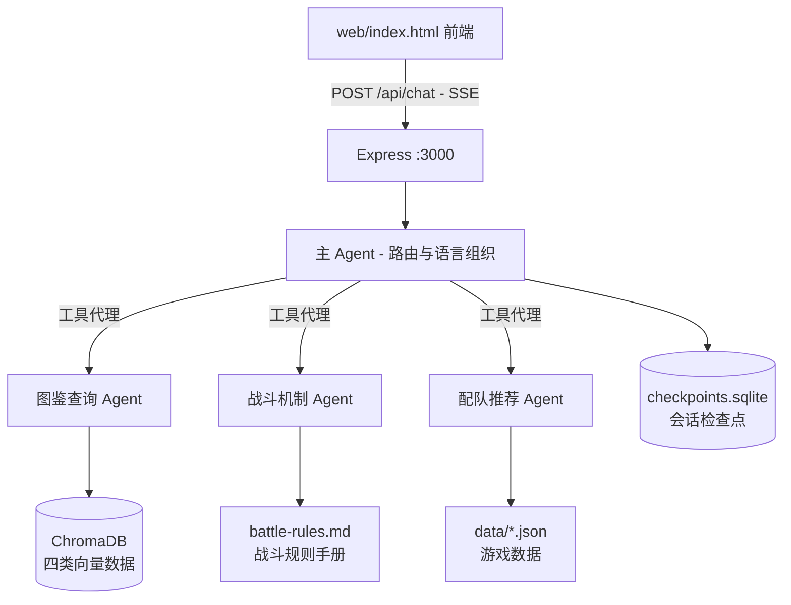

# customer-service-agent · 洛克助手

> 基于 LangChain.js + LangGraph 构建的《洛克王国·世界》AI 游戏助手

为玩家提供**精灵图鉴查询、战斗机制解答、阵容配队推荐**三类服务。采用「主 Agent 路由 + 专家 Agent 分治」的多智能体架构，游戏数据通过 RAG（ChromaDB 向量检索）接入，支持 SSE 流式输出与多轮会话记忆。

## 功能特性

- **多 Agent 协作**：主 Agent 负责理解意图、分发任务、组织语言；图鉴查询 / 战斗机制 / 配队推荐三个专家 Agent 各自持有专属工具集，互不干扰
- **RAG 检索**：精灵、技能、进化链、百科四类游戏数据向量化存入 ChromaDB，通过 `entity_type` 元数据过滤实现分类检索；同时支持精确查询（属性克制、技能效果、统计数据等）
- **战斗机制**：内置 13 章战斗规则手册（Markdown 结构化，按需检索），支持伤害计算与属性克制查询
- **配队推荐**：阵容攻防覆盖率分析、13 种配队体系适配评分、多条件精灵筛选
- **安全护栏**：中间件自动识别并脱敏手机号、身份证号等敏感信息
- **上下文压缩**：对话历史超过阈值时自动由小模型压缩为摘要，控制 token 开销
- **会话持久化**：LangGraph + SQLite 检查点，多轮对话记忆跨请求保留
- **流式输出**：SSE 实时推送模型回复与工具调用进度

## 架构



主 Agent 链上挂载三个中间件：**工具错误拦截**（工具异常转为可读反馈）、**敏感信息脱敏**、**上下文压缩**。专家 Agent 不感知完整对话历史，只接收主 Agent 转写的一句话任务，上下文干净、输出稳定（temperature 0）。

## 技术栈

| 层级 | 技术 |
|---|---|
| 后端 | TypeScript + Express 5 + tsx（免编译直跑） |
| AI 框架 | LangChain.js / LangGraph（多轮工具调用 + 中间件） |
| 向量库 | ChromaDB + BAAI/bge-m3 嵌入模型（1024 维） |
| 大模型 | 任意 OpenAI 兼容协议模型（主/专家 Agent）+ Qwen3-8B（摘要压缩、标题生成） |
| 会话检查点 | LangGraph SqliteSaver |
| 前端 | 单文件 HTML（零构建，浏览器直接打开） |

## 快速开始

### 环境要求

- Node.js 18+（建议 20+），pnpm 11+
- Python 3.9+（建议 3.10+）
- 一个 OpenAI 兼容协议的大模型 API Key
- 硅基流动（SiliconFlow）API Key（免费额度即可覆盖 bge-m3 向量模型与 Qwen3-8B 小模型）

### 安装步骤

以下命令均在 `server/` 目录执行：

```bash
cd server
```

**1. 安装 Node 依赖**

```bash
pnpm install
```

**2. 创建 Python 虚拟环境并安装 ChromaDB**

```bash
python -m venv .venv
.venv\Scripts\activate          # Windows cmd
# .venv\Scripts\Activate.ps1    # Windows PowerShell
# source .venv/bin/activate     # macOS / Linux
pip install -r requirements.txt
```

**3. 配置环境变量**

将 `.env.example` 复制为 `.env` 并填写：

```bash
cp .env.example .env
```

需要填写的核心项：`OPENAI_API_KEY`、`OPENAI_BASE_URL`、`MODEL`（主模型）、`SILICONFLOW_API_KEY`。

**4. 启动服务**

```bash
pnpm run dev
```

该命令会同时启动 API 服务（`http://localhost:3000`）和 ChromaDB 向量数据库（端口 8000）。

**5. 开始使用**

用浏览器直接打开 `web/index.html`，即可与助手对话。

### 环境变量说明

| 变量 | 说明 |
|---|---|
| `OPENAI_API_KEY` / `OPENAI_BASE_URL` | 主模型（OpenAI 兼容协议）的密钥与地址 |
| `MODEL` | 主模型名称，主 Agent 与专家 Agent 共用 |
| `SILICONFLOW_API_KEY` / `SILICONFLOW_BASE_URL` | 硅基流动密钥与地址，用于小模型和向量模型 |
| `SILICONFLOW_MODEL` | 小模型，仅用于上下文压缩与对话标题生成 |
| `SILICONFLOW_VECTOR_MODEL` | 向量嵌入模型，需与向量库灌注时保持一致（默认 `BAAI/bge-m3`） |
| `LANGSMITH_TRACING` / `LANGSMITH_API_KEY` / `LANGSMITH_PROJECT` | LangSmith 链路追踪（可选） |
| `PORT` | API 服务端口，默认 3000 |

## 可用脚本

| 命令 | 说明 |
|---|---|
| `pnpm run dev` | 同时启动 API 服务（3000）与 ChromaDB（8000） |
| `pnpm run script` | 向 ChromaDB 增量灌注游戏数据（仓库已含灌好的向量库，首次无需执行） |

## API 接口

| 方法 | 路径 | 说明 |
|---|---|---|
| POST | `/api/chat` | 对话接口，SSE 流式响应 |
| POST | `/api/delete_messages` | 删除当前会话历史 |
| GET | `/api/health` | 健康检查 |

## 项目结构

```
customer-service-agent/
├── server/
│   ├── src/
│   │   ├── agent/          # 4 个 Agent 定义：main / query / battle / team
│   │   ├── tools/          # 子 Agent 代理工具 + 游戏工具集（RAG 检索/精确查询/阵容分析）
│   │   ├── middleware/     # LangGraph 中间件：工具错误拦截 / 敏感信息脱敏 / 上下文压缩
│   │   ├── rag/            # Chroma 向量检索（entity_type 过滤 + 距离阈值）
│   │   ├── prompts/        # 系统提示词 + 战斗规则手册 battle-rules.md
│   │   ├── data/           # 游戏数据 JSON（精灵/技能/进化链/属性克制等）
│   │   ├── routes/         # chat（SSE 流式）/ health / messages 路由
│   │   ├── services/       # chat 服务，驱动主 Agent 流式调用
│   │   └── script/         # 数据转文本 + 向量灌库脚本
│   ├── chroma-data/        # ChromaDB 数据目录（已预灌注，开箱即用）
│   ├── checkpoints.sqlite  # 会话检查点数据库（运行时生成）
│   └── .env.example        # 环境变量模板
└── web/
    └── index.html          # 前端界面（单文件，无需构建）
```

## 说明

- **开箱即用**：向量库已随仓库预灌注（`server/chroma-data`），克隆后无需灌库即可启动。游戏数据更新时可执行 `pnpm run script` 增量灌注（嵌入模型不可更换，否则向量空间不匹配）。
- **会话数据**：对话历史保存在 `server/checkpoints.sqlite`，删除该文件即可重置全部会话。
- **数据来源**：精灵 / 技能 / 进化链等游戏数据参考自开源项目 roco-kingdom，感谢原项目的数据整理工作。
